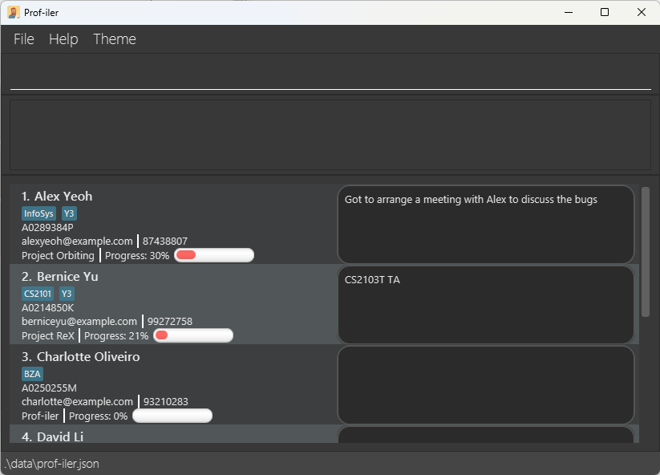
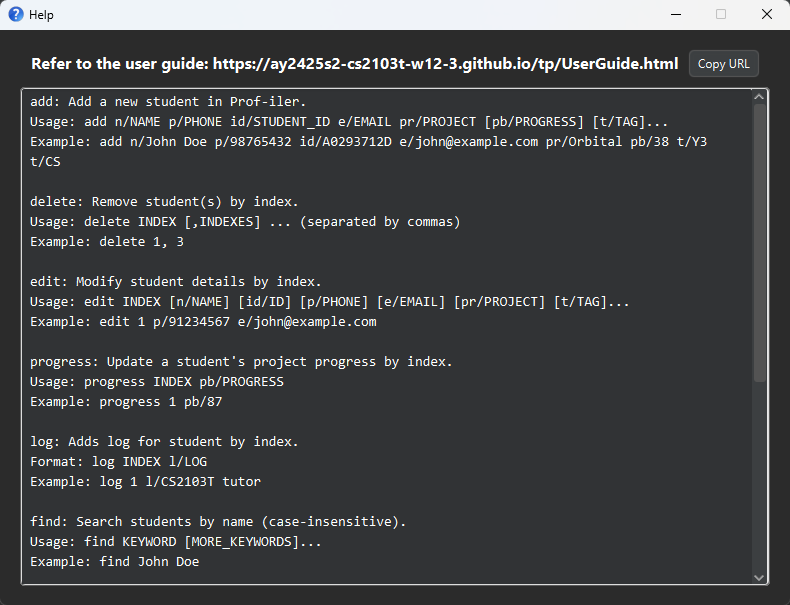
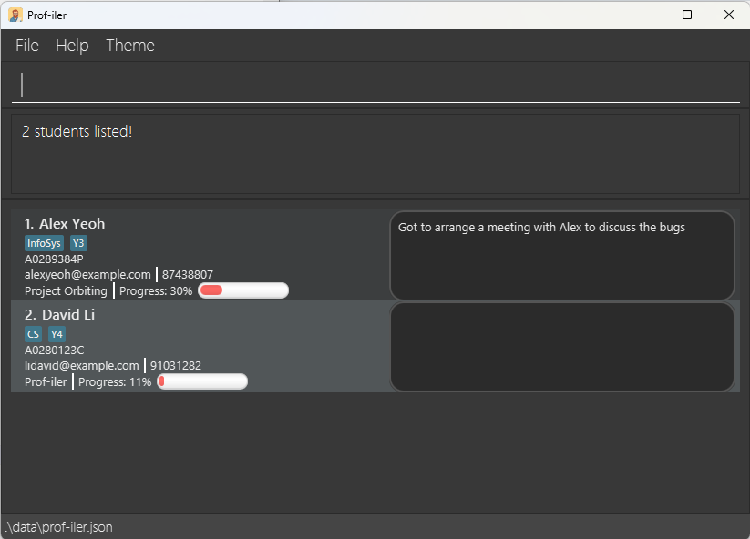
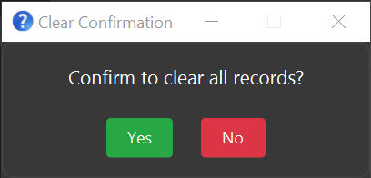

Prof-iler is a **desktop app for managing contacts, optimized for use via a Command Line Interface** (CLI) while still having the benefits of a Graphical User Interface (GUI). If you can type fast, AB3 can get your contact management tasks done faster than traditional GUI apps.

* Table of Contents
{:toc}

--------------------------------------------------------------------------------------------------------------------

## Quick start

1. Ensure you have Java `17` or above installed in your Computer. 
   **Mac users:** Ensure you have the precise JDK version prescribed [here](https://se-education.org/guides/tutorials/javaInstallationMac.html).

1. Download the latest `.jar` file from [here](https://github.com/AY2425S2-CS2103T-W12-3/tp/releases).

1. Copy the file to the folder you want to use as the _home folder_ for your Prof-iler application.

1. Open a command terminal, `cd` into the folder you put the jar file in, and use the `java -jar Prof-iler.jar` command to run the application. 
   A GUI similar to the below should appear in a few seconds. Note how the app contains some sample data. 
   

1. Type the command in the command box and press Enter to execute it. e.g. typing **`help`** and pressing Enter will open the help window. 
   Some example commands you can try:

   * `list` : Lists all contacts.

   * `add n/John Doe p/98765432 e/johnd@example.com pr/Prof-iler pb/72 t/Y3 CS` : Adds a contact named `John Doe` to Prof-iler

   * `delete 3` : Deletes the 3rd contact shown in the current list.

   * `clear` : Deletes all contacts.

   * `exit` : Exits the app.

1. Refer to the [Features](#features) below for details of each command.

--------------------------------------------------------------------------------------------------------------------

## Features

**:information_source: Notes about the command format:** 

* Words in `UPPER_CASE` are the parameters to be supplied by the user. 
  e.g. in `add n/NAME`, `NAME` is a parameter which can be used as `add n/John Doe`.

* Items in square brackets are optional. 
  e.g `n/NAME [t/TAG]` can be used as `n/John Doe t/Y4` or as `n/John Doe`.

* Items with `…`​ after them can be used multiple times including zero times. 
  e.g. `[t/TAG]…​` can be used as ` ` (i.e. 0 times), `t/Y4`, `t/CS t/Y4` etc.

* Parameters can be in any order. 
  e.g. if the command specifies `n/NAME p/PHONE_NUMBER`, `p/PHONE_NUMBER n/NAME` is also acceptable.

* Extraneous parameters for commands that do not take in parameters (such as `help`, `list`, `exit` and `clear`) will be ignored. 
  e.g. if the command specifies `help 123`, it will be interpreted as `help`.

* If you are using a PDF version of this document, be careful when copying and pasting commands that span multiple lines as space characters surrounding line-breaks may be omitted when copied over to the application.

### Viewing help : `help`

Shows a link to the user guide and a list of all commands available in Prof-iler.

Format: `help`, can also be accessed via `F1` function key

### Adding a person: `add`

Adds a person to Prof-iler.

Format: `add n/NAME id/STUDENT_ID p/PHONE e/EMAIL pr/PROJECT [pb/PROGRESS] [t/TAG]…​`

:bulb: **Tip:**  
A person can have any number of tags (including 0).  
A person can have unmentioned progress (default = 0).

Examples:
* `add n/John Doe id/A0253517M p/98765432 e/johnd@example.com pr/Project Prof-iler`
* `add n/Betsy Crowe t/Y4 id/A0055729D e/betsycrowe@example.com p/1234567 pr/Orbital`

### Listing all persons : `list`

Shows a list of all persons in Prof-iler.

Format: `list`

### Editing a person : `edit`

Edits an existing person in Prof-iler.

Format: `edit INDEX [n/NAME] [id/STUDENT_ID] [p/PHONE] [e/EMAIL] [pr/PROJECT] [pb/PROGRESS] [t/TAG]…​`

* Edits the person at the specified `INDEX`. The index refers to the index number shown in the displayed person list. The index **must be a positive integer** 1, 2, 3, …​
* At least one of the optional fields must be provided.
* Existing values will be updated to the input values.
* When editing tags, the existing tags of the person will be removed i.e adding of tags is not cumulative.
* You can remove all the person’s tags by typing `t/` without
    specifying any tags after it.

Examples:
*  `edit 1 p/91234567 e/johndoe@example.com` Edits the phone number and email address of the 1st person to be `91234567` and `johndoe@example.com` respectively.
*  `edit 2 n/Betsy Crower t/` Edits the name of the 2nd person to be `Betsy Crower` and clears all existing tags.

### Editing the progress : `progress`

Edits the progress of an existing person in Prof-iler.

Format: `progress INDEX pb/PROGRESS`

* Edits the person at the specified `INDEX`.
* The index refers to the index number shown in the displayed person list.
* The index **must be a positive integer** 1, 2, 3, …​
* Existing progress will be updated to the input progress.

Example:
*  `progress 1 pb/45` Edits the progress of the 1st person to be `45`.

### Entering log for a student: `log`

Adds log for the person whose index is specified.

Format: `log INDEX l/LOG`

* Adds the log to the person at the specified `INDEX`.
* The index refers to the index number shown in the displayed person list.
* The index **must be a positive integer** 1, 2, 3, …​

Examples:
* `log 1 l/CS2103T tutor` Edits the log of the 1st student to be `CS2103T tutor`.

### Locating persons by name: `find`

Finds persons whose names contain any of the given keywords.

Format: `find KEYWORD [MORE_KEYWORDS]`

* The search is case-insensitive. e.g `hans` will match `Hans`
* The order of the keywords does not matter. e.g. `Hans Bo` will match `Bo Hans`
* Only the name is searched.
* Only full words will be matched e.g. `Han` will not match `Hans`
* Persons matching at least one keyword will be returned (i.e. `OR` search).
  e.g. `Hans Bo` will return `Hans Gruber`, `Bo Yang`

Examples:
* `find John` returns `john` and `John Doe`
* `find alex david` returns `Alex Yeoh`, `David Li` 
  

### Filter for specific projects: `filter`

Filters for projects that contain any of the given keywords.

Format: `filter KEYWORD [MORE_KEYWORDS]`

* The search is case-insensitive.
* The order of the given keywords does not matter.
* All the filtered student under the project will be shown in the displayed person list.

Examples:
* `filter prof-iler` returns `David Li` and `JianXi` which are the two students under the project `Prof-iler`
    

### Deleting persons : `delete`

Deletes the specified person from Prof-iler.

Format: `delete INDEX [,INDEXES] ...`

* Deletes the person(s) at the specified `INDEX` or `INDEXES`.
* The indexes refers to the index number shown in the displayed person list.
* The index **must be a positive integer** 1, 2, 3, …​
* Indexes can be specified in a list separated by commas (,), allowing for multiple deletions in a single command.

Examples:
* `list` followed by `delete 2` deletes the 2nd person in Prof-iler.
* `find Betsy` followed by `delete 1` deletes the 1st person in the results of the `find` command.
* delete 1, 3, 4 deletes the 1st, 3rd, and 4th persons from the displayed list in Prof-iler.

### Clearing all entries : `clear`

Clears all entries from Prof-iler.

A pop-up message to confirm your action will appear. It defaults to `No` to prevent accidental deletion.

Simply use keyboard arrow keys to toggle between the options. Press `enter` on your keyboard to confirm the selection. Alternatively, you can also click on the buttons using your cursor.

Format: `clear`

### Exiting the program : `exit`

Exits the program.

Format: `exit`

### Saving the data

Prof-iler data are saved in the hard disk automatically after any command that changes the data. There is no need to save manually.

### Editing the data file

Prof-iler data are saved automatically as a JSON file `[JAR file location]/data/prof-iler.json`. Advanced users are welcome to update data directly by editing that data file.

:exclamation: **Caution:**
If your changes to the data file makes its format invalid, Prof-iler will discard all data and start with an empty data file at the next run. Hence, it is recommended to take a backup of the file before editing it. 
Furthermore, certain edits can cause the Prof-iler application to behave in unexpected ways (e.g., if a value entered is outside of the acceptable range). Therefore, edit the data file only if you are confident that you can update it correctly.

### Archiving data files `[coming in v1.4]`

_Details coming soon ..._

--------------------------------------------------------------------------------------------------------------------

## FAQ

**Q**: How do I transfer my data to another Computer? 
**A**: Install the app in the other computer and overwrite the empty data file it creates with the file that contains the data of your previous Prof-iler home folder.

--------------------------------------------------------------------------------------------------------------------

## Known issues

1. **When using multiple screens**, if you move the application to a secondary screen, and later switch to using only the primary screen, the GUI will open off-screen. The remedy is to delete the `preferences.json` file created by the application before running the application again.
2. **If you minimize the Help Window** and then run the `help` command (or use the `Help` menu, or the keyboard shortcut `F1`) again, the original Help Window will remain minimized, and no new Help Window will appear. The remedy is to manually restore the minimized Help Window.

--------------------------------------------------------------------------------------------------------------------

## Command summary

Action | Format, Examples
--------|------------------
**Add** | `add n/NAME id/STUDENT_ID p/PHONE_NUMBER e/EMAIL pr/PROJECT pb/PROGRESS [t/TAG]…​`   e.g., `add n/James Ho id/A0223615H p/22224444 e/jamesho@example.com pr/Project_Orbit t/Y3 pb/29 t/BZA`
**Clear** | `clear`
**Delete** | `delete INDEX [,INDEXES] ...`  e.g., `delete 1, 3`
**Edit** | `edit INDEX [n/NAME] [id/STUDENT_ID] [p/PHONE] [e/EMAIL] [pr/PROJECT] [pb/PROGRESS] [t/TAG]…​`  e.g.,`edit 2 n/James Lee id/A0112946T e/jameslee@example.com`
**Filter** | `filter KEYWORD [MORE_KEYWORDS]`  e.g., `filter prof-iler`
**Find** | `find KEYWORD [MORE_KEYWORDS]`  e.g., `find James Jake`
**Progress** | `progress INDEX [pb/PROGRESS]`  e.g., `progress 1 pb/45`
**List** | `list`
**Log** | `log INDEX l/LOG`
**Help** | `help`
